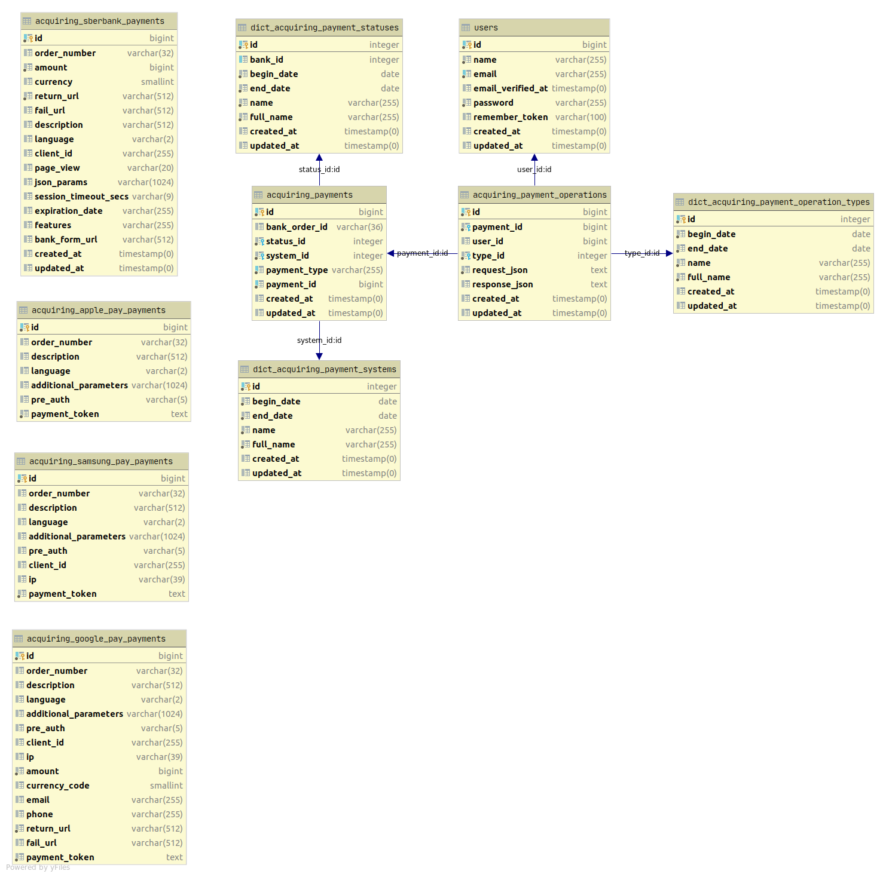

# Laravel Sberbank Acquiring

[](https://codecov.io/gh/avlyalin/laravel-sberbank-acquiring)
[](https://lbesson.mit-license.org/)

Пакет предоставляет вашему приложению функционал для работы с платежами с использованием эквайринга от Сбербанка.
Возможности:
- Создание и хранение платежей
- Логирование операций по платежам

Перед использованием рекомендуется ознакомиться с документацией, предоставляемой Сбербанком.

## Требования
* PHP >= 7.2
* Laravel >= 5.8
* Расширения PHP: ext-json, ext-curl
* Реляционная БД

## Установка
Добавьте пакет в зависимости:
```
composer require avlyalin/laravel-sberbank-acquiring
```

Опубликуйте файл настроек:
```
php artisan vendor:publish --provider="Avlyalin\SberbankAcquiring\Providers\AcquiringServiceProvider" --tag=config
```

Запустите миграции:
```
php artisan migrate
```

## Обзор
* [Таблицы](#Таблицы)
* [Клиент](#Клиент)
* [Операции](#Операции)
* [Настройки](#Настройки)
* [Аутентификация](#Аутентификация)
* [Обновление статусов платежей](#Обновление-статусов-платежей)
* [События (Events)](#Cобытия-events)
* [Исключения (Exception)](#Исключения-exceptions)
* [Поддержка](#Поддержка)
* [Лицензия (License)](#Лицензия-license)

## Таблицы
Для хранения истории платежей и операций создаётся несколько таблиц:
* **acquiring_payments** - базовая таблица платежей, хранит общую информацию по платежам всех платежных систем
* **acquiring_payment_operations** - операции по платежам
* **acquiring_sberbank_payments** - платежи напрямую через систему Сбербанка
* **acquiring_apple_pay_payments** - платежи через Apple Pay
* **acquiring_samsung_pay_payments** - платежи через Samsung Pay
* **acquiring_google_pay_payments** - платежи через Google Pay
* **dict_acquiring_payment_statuses** - справочник статусов платежей
* **dict_acquiring_payment_operation_types** - справочник типов операций
* **dict_acquiring_payment_systems** - справочник платежных систем

Диаграмма:


> Связь базового платежа и платежей в разных платежных системах организована на уровне ORM через полиморфную связь.

## Клиент
Пакет содержит два класса-клиента для работы с эквайрингом:
* `ApiClient` - вызывает API Сбербанка
* `Client` - обёртка для `ApiClient`, сохраняет платежи и операции в БД, использует файл настроек. Рекомендуется пользоваться им.

`ApiClient` и `Client` добавлены в [Service Container](https://laravel.com/docs/5.8/container) и могут быть использованы
в Dependency Injection.
Резолвинг классов:
```php
use Avlyalin\SberbankAcquiring\Client\ApiClient;
use Avlyalin\SberbankAcquiring\Client\Client;

$client = $this->app->make(Client::class);

$apiClient = $this->app->make(ApiClient::class);
```

## Операции
На данный момент поддерживаются следующие операции эквайринга:

| Операция                                    | Документация Сбербанка |
| --------------------------------------------|----------------------------------|
| [Регистрация заказа](#Регистрация-заказа) | [Ссылка](https://securepayments.sberbank.ru/wiki/doku.php/integration:api:rest:requests:register) |
| [Регистрация заказа с предавторизацией](#Регистрация-заказа-с-предавторизацией) | [Ссылка](https://securepayments.sberbank.ru/wiki/doku.php/integration:api:rest:requests:registerpreauth) |
| [Запрос завершения оплаты заказа](#Запрос-завершения-оплаты-заказа) | [Ссылка](https://securepayments.sberbank.ru/wiki/doku.php/integration:api:rest:requests:deposit) |
| [Запрос отмены оплаты заказа](#Запрос-отмены-оплаты-заказа) | [Ссылка](https://securepayments.sberbank.ru/wiki/doku.php/integration:api:rest:requests:reverse) |
| [Запрос возврата средств оплаты заказа](#Запрос-возврата-средств-оплаты-заказа) | [Ссылка](https://securepayments.sberbank.ru/wiki/doku.php/integration:api:rest:requests:refund) |
| [Получение статуса заказа](#Получение-статуса-заказа) | [Ссылка](https://securepayments.sberbank.ru/wiki/doku.php/integration:api:rest:requests:getorderstatusextended) |
| [Запрос оплаты через Apple Pay](#Запрос-оплаты-через-Apple-Pay) | [Ссылка](https://securepayments.sberbank.ru/wiki/doku.php/integration:api:rest:requests:payment_applepay) |
| [Запрос оплаты через Samsung Pay](#Запрос-оплаты-через-Samsung-Pay) | [Ссылка](https://securepayments.sberbank.ru/wiki/doku.php/integration:api:rest:requests:payment_samsungpay) |
| [Запрос оплаты через Google Pay](#Запрос-оплаты-через-Google-Pay) | [Ссылка](https://securepayments.sberbank.ru/wiki/doku.php/integration:api:rest:requests:payment_googlepay) |
| [Запрос сведений о кассовом чеке](#Запрос-сведений-о-кассовом-чеке) | [Ссылка](https://securepayments.sberbank.ru/wiki/doku.php/integration:api:rest:requests:getreceiptstatus) |
| [Запрос деактивации связки](#Запрос-деактивации-связки) | [Ссылка](https://securepayments.sberbank.ru/wiki/doku.php/integration:api:rest:requests:unbindcard) |
| [Запрос активации связки](#Запрос-активации-связки) | [Ссылка](https://securepayments.sberbank.ru/wiki/doku.php/integration:api:rest:requests:bindcard) |
| [Запрос списка всех связок клиента](#Запрос-списка-всех-связок-клиента) | [Ссылка](https://securepayments.sberbank.ru/wiki/doku.php/integration:api:rest:requests:getbindings) |
| [Запрос списка связок определённой банковской карты](#Запрос-списка-связок-определённой-банковской-карты) | [Ссылка](https://securepayments.sberbank.ru/wiki/doku.php/integration:api:rest:requests:getbindingsbycardorid) |
| [Запрос изменения срока действия связки](#Запрос-изменения-срока-действия-связки) | [Ссылка](https://securepayments.sberbank.ru/wiki/doku.php/integration:api:rest:requests:extendbinding) |

### Регистрация заказа
Обязательный аргумент - сумма.

```php
use Avlyalin\SberbankAcquiring\Client\HttpClientInterface;
use Avlyalin\SberbankAcquiring\Client\Client;

$client = $this->app->make(Client::class);
$acquiringPayment = $client->register(
    1000, // сумма
    ['orderNumber' => '123-456'], // необязательные параметры
    HttpClientInterface::METHOD_GET, // метод запроса
    ['Cache-Control' => 'no-cache'] // хэдеры запроса
);
$status = $acquiringPayment->status->name; // 'Зарегистрирован'
```
> Если во втором аргументе не указаны параметры **returnUrl** и **failUrl**, то они берутся из файла настроек.

### Регистрация заказа с предавторизацией
Обязательный аргумент - сумма.

```php
use Avlyalin\SberbankAcquiring\Client\HttpClientInterface;
use Avlyalin\SberbankAcquiring\Client\Client;

$client = $this->app->make(Client::class);
$acquiringPayment = $client->registerPreAuth(
    1000, // сумма
    ['orderNumber' => '123-456'], // необязательные параметры
    HttpClientInterface::METHOD_GET, // метод запроса
    ['Cache-Control' => 'no-cache'] // хэдеры запроса
);
$status = $acquiringPayment->status->name; // 'Зарегистрирован'
```
> Если во втором аргументе не указаны параметры **returnUrl** и **failUrl**, то они берутся из файла настроек.

### Запрос завершения оплаты заказа
Обязательные аргументы: id модели платежа (AcquiringPayment), сумма.

```php
use Avlyalin\SberbankAcquiring\Client\HttpClientInterface;
use Avlyalin\SberbankAcquiring\Client\Client;

$client = $this->app->make(Client::class);
$acquiringPayment = $client->deposit(
    1, // id модели платежа (AcquiringPayment)
    1000, // сумма
    [], // необязательные параметры
    HttpClientInterface::METHOD_GET, // метод запроса
    ['Cache-Control' => 'no-cache'] // хэдеры запроса
);
```

### Запрос отмены оплаты заказа
Обязательный аргумент - id модели платежа (AcquiringPayment).

```php
use Avlyalin\SberbankAcquiring\Client\HttpClientInterface;
use Avlyalin\SberbankAcquiring\Client\Client;

$client = $this->app->make(Client::class);
$acquiringPayment = $client->reverse(
    1, // id модели платежа (AcquiringPayment)
    ['language' => 'EN'], // необязательные параметры
    HttpClientInterface::METHOD_GET, // метод запроса
    ['Cache-Control' => 'no-cache'] // хэдеры запроса
);
```

### Запрос возврата средств оплаты заказа
Обязательные аргументы: id модели платежа (AcquiringPayment), сумма.

```php
use Avlyalin\SberbankAcquiring\Client\HttpClientInterface;
use Avlyalin\SberbankAcquiring\Client\Client;

$client = $this->app->make(Client::class);
$acquiringPayment = $client->refund(
    1, // id модели платежа (AcquiringPayment)
    500, // сумма
    ['language' => 'EN'], // необязательные параметры
    HttpClientInterface::METHOD_GET, // метод запроса
    ['Cache-Control' => 'no-cache'] // хэдеры запроса
);
```

### Получение статуса заказа
Обязательный аргумент - id модели платежа (AcquiringPayment).

```php
use Avlyalin\SberbankAcquiring\Client\HttpClientInterface;
use Avlyalin\SberbankAcquiring\Client\Client;

$client = $this->app->make(Client::class);
$acquiringPayment = $client->getOrderStatusExtended(
    1, // id модели платежа (AcquiringPayment)
    ['language' => 'EN'], // необязательные параметры
    HttpClientInterface::METHOD_GET, // метод запроса
    ['Cache-Control' => 'no-cache'] // хэдеры запроса
);
```

### Запрос оплаты через Apple Pay
Обязательный аргумент - **paymentToken**, полученный от системы Apple Pay. Подробнее [здесь](https://securepayments.sberbank.ru/wiki/doku.php/integration:api:rest:requests:payment_applepay).

```php
use Avlyalin\SberbankAcquiring\Client\HttpClientInterface;
use Avlyalin\SberbankAcquiring\Client\Client;

$client = $this->app->make(Client::class);
$acquiringPayment = $client->payWithApplePay(
    'vnkXadsIDvejvKQPvcxbTqeEhfbPOG', // Токен, полученный от системы Apple Pay
    [ // необязательные параметры
        'orderNumber' => '123_abc',
        'language' => 'EN',
        'description' => 'payment description',
    ],
    HttpClientInterface::METHOD_GET, // метод запроса
    ['Cache-Control' => 'no-cache'] // хэдеры запроса
);
```

### Запрос оплаты через Samsung Pay
Обязательный аргумент - **paymentToken**, полученный от системы Samsung Pay. Подробнее [здесь](https://securepayments.sberbank.ru/wiki/doku.php/integration:api:rest:requests:payment_samsungpay).

```php
use Avlyalin\SberbankAcquiring\Client\HttpClientInterface;
use Avlyalin\SberbankAcquiring\Client\Client;

$client = $this->app->make(Client::class);
$acquiringPayment = $client->payWithSamsungPay(
    'vnkXadsIDvejvKQPvcxbTqeEhfbPOG', // Токен, полученный от системы Samsung Pay
    [ // необязательные параметры
        'orderNumber' => '123_abc',
        'language' => 'EN',
        'description' => 'payment description',
    ],
    HttpClientInterface::METHOD_GET, // метод запроса
    ['Cache-Control' => 'no-cache'] // хэдеры запроса
);
```

### Запрос оплаты через Google Pay
Обязательные аргументы: **paymentToken**, полученный от системы Google Pay, сумма. Подробнее [здесь](https://securepayments.sberbank.ru/wiki/doku.php/integration:api:rest:requests:payment_googlepay).

```php
use Avlyalin\SberbankAcquiring\Client\HttpClientInterface;
use Avlyalin\SberbankAcquiring\Client\Client;

$client = $this->app->make(Client::class);
$acquiringPayment = $client->payWithGooglePay(
    'vnkXadsIDvejvKQPvcxbTqeEhfbPOG', // Токен, полученный от системы Google Pay
    1000,
    [ // необязательные параметры
        'orderNumber' => '123_abc',
        'language' => 'EN',
        'description' => 'payment description',
    ],
    HttpClientInterface::METHOD_GET, // метод запроса
    ['Cache-Control' => 'no-cache'] // хэдеры запроса
);
```

### Запрос сведений о кассовом чеке
Описание [здесь](https://securepayments.sberbank.ru/wiki/doku.php/integration:api:rest:requests:getreceiptstatus).

```php
use Avlyalin\SberbankAcquiring\Client\HttpClientInterface;
use Avlyalin\SberbankAcquiring\Client\ApiClient;

$apiClient = $this->app->make(ApiClient::class);
$response = $apiClient->getReceiptStatus(
    [ // параметры
        'orderId' => 'kvp431_Wmvx_gqQx',
        'language' => 'EN'
    ],
    HttpClientInterface::METHOD_GET, // метод запроса
    ['Cache-Control' => 'no-cache'] // хэдеры запроса
);

if ($response->isOk) {
    print_r($response->getResponseArray());
} else {
    print_r($response->getErrorMessage());
}
```

### Запрос активации связки
Обязательный аргумент - идентификатор созданной ранее связки. Подробнее [здесь](https://securepayments.sberbank.ru/wiki/doku.php/integration:api:rest:requests:bindcard).

```php
use Avlyalin\SberbankAcquiring\Client\HttpClientInterface;
use Avlyalin\SberbankAcquiring\Client\ApiClient;

$apiClient = $this->app->make(ApiClient::class);
$response = $apiClient->bindCard(
    '131-cvlg-1vcvc-14cvx', // id связки
    [], // необязательные параметры
    HttpClientInterface::METHOD_GET, // метод запроса
    ['Cache-Control' => 'no-cache'] // хэдеры запроса
);

if ($response->isOk) {
    print_r($response->getResponseArray());
} else {
    print_r($response->getErrorMessage());
}
```

### Запрос деактивации связки
Обязательный аргумент - идентификатор созданной ранее связки. Подробнее [здесь](https://securepayments.sberbank.ru/wiki/doku.php/integration:api:rest:requests:unbindcard).

```php
use Avlyalin\SberbankAcquiring\Client\HttpClientInterface;
use Avlyalin\SberbankAcquiring\Client\ApiClient;

$apiClient = $this->app->make(ApiClient::class);
$response = $apiClient->unBindCard(
    '131-cvlg-1vcvc-14cvx', // id связки
    [], // необязательные параметры
    HttpClientInterface::METHOD_GET, // метод запроса
    ['Cache-Control' => 'no-cache'] // хэдеры запроса
);

if ($response->isOk) {
    print_r($response->getResponseArray());
} else {
    print_r($response->getErrorMessage());
}
```

### Запрос списка всех связок клиента
Обязательный аргумент - номер (идентификатор) клиента в системе магазина. Подробнее [здесь](https://securepayments.sberbank.ru/wiki/doku.php/integration:api:rest:requests:getbindings).

```php
use Avlyalin\SberbankAcquiring\Client\HttpClientInterface;
use Avlyalin\SberbankAcquiring\Client\ApiClient;

$apiClient = $this->app->make(ApiClient::class);
$response = $apiClient->getBindings(
    'client-id-1', // номер (идентификатор) клиента
    [], // необязательные параметры
    HttpClientInterface::METHOD_GET, // метод запроса
    ['Cache-Control' => 'no-cache'] // хэдеры запроса
);

if ($response->isOk) {
    print_r($response->getResponseArray());
} else {
    print_r($response->getErrorMessage());
}
```

### Запрос списка связок определённой банковской карты
Описание [здесь](https://securepayments.sberbank.ru/wiki/doku.php/integration:api:rest:requests:getbindingsbycardorid).

```php
use Avlyalin\SberbankAcquiring\Client\HttpClientInterface;
use Avlyalin\SberbankAcquiring\Client\ApiClient;

$apiClient = $this->app->make(ApiClient::class);
$response = $apiClient->getBindingsByCardOrId(
    'client-id-1', // номер (идентификатор) клиента
    [], // необязательные параметры
    HttpClientInterface::METHOD_GET, // метод запроса
    ['Cache-Control' => 'no-cache'] // хэдеры запроса
);

if ($response->isOk) {
    print_r($response->getResponseArray());
} else {
    print_r($response->getErrorMessage());
}
```

### Запрос изменения срока действия связки
Обязательный аргумент - идентификатор созданной ранее связки. Подробнее [здесь](https://securepayments.sberbank.ru/wiki/doku.php/integration:api:rest:requests:extendbinding).

```php
use Avlyalin\SberbankAcquiring\Client\HttpClientInterface;
use Avlyalin\SberbankAcquiring\Client\ApiClient;

$apiClient = $this->app->make(ApiClient::class);
$response = $apiClient->getBindingsByCardOrId(
    '131-cvlg-1vcvc-14cvx', // id связки
    [ // параметры
        'newExpiry' => 202012,
    ],
    HttpClientInterface::METHOD_GET, // метод запроса
    ['Cache-Control' => 'no-cache'] // хэдеры запроса
);

if ($response->isOk) {
    print_r($response->getResponseArray());
} else {
    print_r($response->getErrorMessage());
}
```

### Запрос проверки вовлечённости карты в 3DS
Обязательный аргумент - маскированный номер карты, которая использовалась для оплаты (PAN). Подробнее [здесь](https://securepayments.sberbank.ru/wiki/doku.php/integration:api:rest:requests:verifyenrollment).

```php
use Avlyalin\SberbankAcquiring\Client\HttpClientInterface;
use Avlyalin\SberbankAcquiring\Client\ApiClient;

$apiClient = $this->app->make(ApiClient::class);
$response = $apiClient->verifyEnrollment(
    '4111111111111111', // номер карты
    HttpClientInterface::METHOD_GET, // метод запроса
    ['Cache-Control' => 'no-cache'] // хэдеры запроса
);

if ($response->isOk) {
    print_r($response->getResponseArray());
} else {
    print_r($response->getErrorMessage());
}
```

## Настройки
Ознакомьтесь с [файлом настроек](./config/sberbank-acquiring.php).

## Аутентификация
Для аутентификации при обращении к платёжному шлюзу можно использовать следующие данные, полученные при регистрации:
* пара логин/пароль служебной учетной записи
* токен
* *логин продавца (при использовании платежных систем Apple Pay, Samsung Pay, Google Pay)*

файл конфигурации предоставляет параметры для задания данных аутентификации:
```
...
    'auth' => [
        'userName' => env('SBERBANK_USERNAME', ''),
        'password' => env('SBERBANK_PASSWORD', ''),
        'token' => env('SBERBANK_TOKEN', ''),
    ],
    'merchant_login' => env('SBERBANK_MERCHANT_LOGIN', ''),
...
```

Задать данные можно либо отредактировав файл конфигурации, либо указав их в `.env`:
```dotenv
SBERBANK_USERNAME=your_username
SBERBANK_USERNAME=your_password
SBERBANK_TOKEN=your_token
SBERBANK_MERCHANT_LOGIN=your_merchant_login
```

## Обновление статусов платежей
Некоторые операции не позволяют определить новый статус платежа. Для обновления статусов реализована **artisan**-команда,
вызывающая операцию `getOrderStatusExtended` для всех платежей с заданным статусом.

Команда принимает аргумент **id** - набор id статусов платежей, для которых нужно обновить статус:

```
php artisan sberbank-acquiring:update-statuses --id=1 --id=7
```

Рекомендуется добавить команду в шедулер (**app/Console/Kernel.php**):
```php
    use Avlyalin\SberbankAcquiring\Commands\UpdateStatusCommand;
    use Avlyalin\SberbankAcquiring\Models\DictAcquiringPaymentStatus;

    protected function schedule(Schedule $schedule)
    {
        $schedule->command(UpdateStatusCommand::class, [
            '--id' => [
                DictAcquiringPaymentStatus::NEW,
                DictAcquiringPaymentStatus::ACS_AUTH,
            ],
        ])->everyMinute();
    }

```

## События (Events)
На данный момент реализовано одно событие:

| Событие                         | Описание                                              | Параметр          |
|---------------------------------|-------------------------------------------------------|-------------------|
| *UpdateStatusCommandHasFailed*  | Во время обновления статусов платежей возникли ошибки | Массив исключений |

## Исключения (Exceptions)
Пакет выбрасывает исключения, в случае возникновения ошибок.

| Исключение                         | Причина                                              |
|---------------------------------|-------------------------------------------------------|
| *HttpClientException*  | В ответ на запрос сервер вернул код, отличный от 200 |
| *NetworkException*  | Не удалось выполнить запрос |
| *JsonException*  | Не удалось декодировать JSON ответ сервера |
| *ResponseProcessingException*  | Не удалось сохранить ответ сервера |
| *ConfigException*  | Ошибка файла конфигурации |
| *ModelNotFoundException*  | Не удалось найти модель (платеж) |
| *\InvalidArgumentException*  | Некорректные параметры запроса |
| *\Throwable*  | При сохранении модели возникла ошибка |


## Поддержка
Если этот проект оказался для вас полезным, вы можете [поддержать его развитие здесь](https://www.patreon.com/user?u=38431737).

## Лицензия (License)
The MIT License (MIT). Please see [License File](https://github.com/avlyalin/laravel-sberbank-acquiring) for more information.
